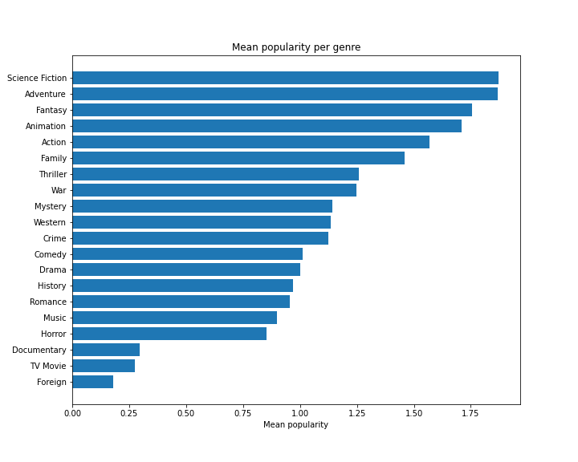
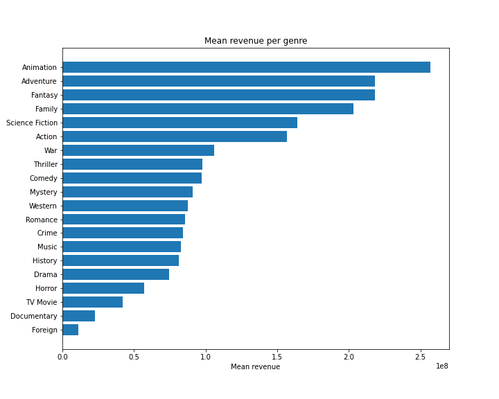
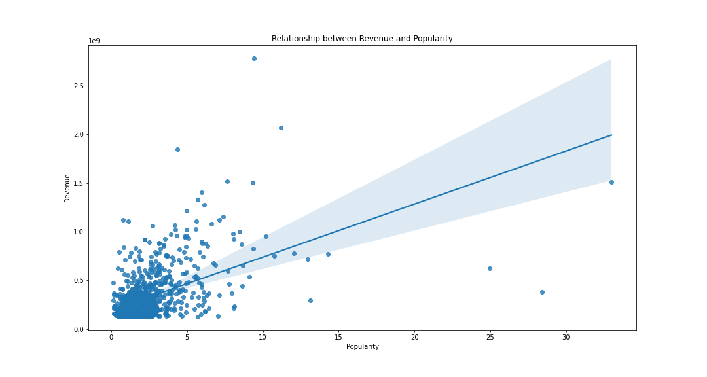
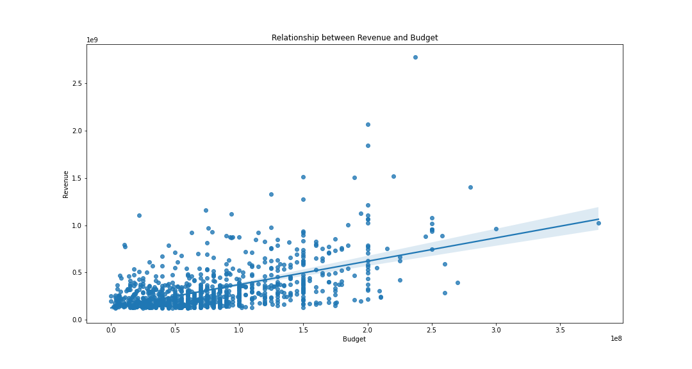
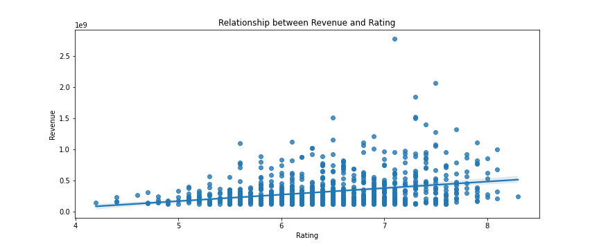
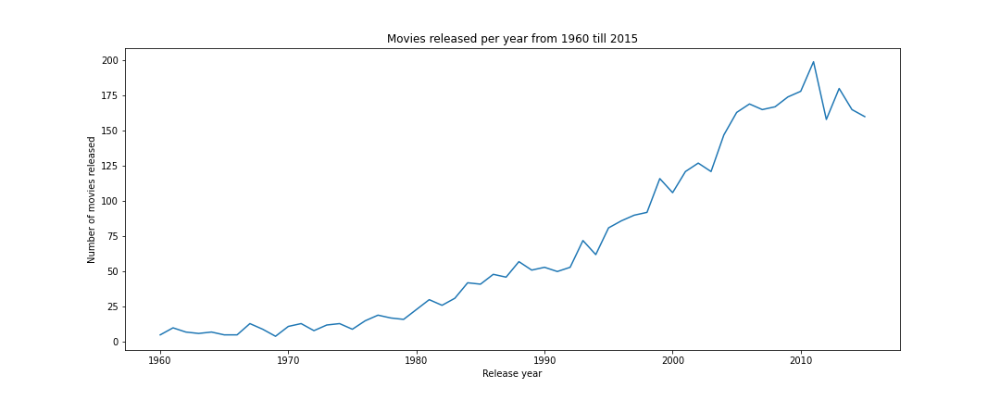
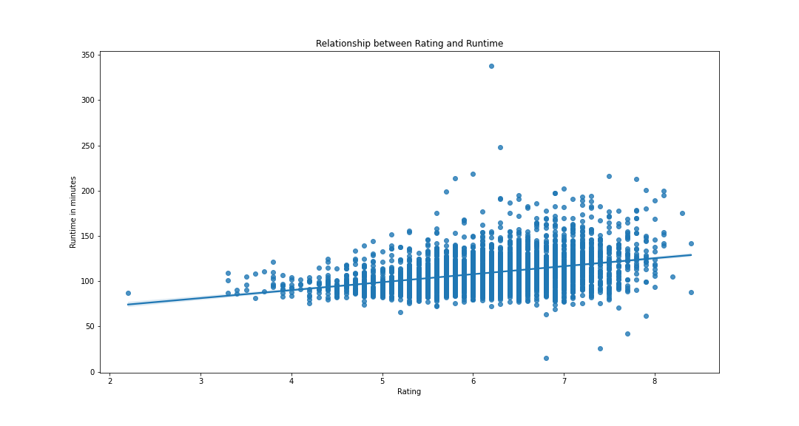
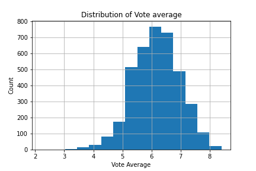

# PROJECT: TMDB Movie Dataset Analysis
#### Author: Abasifreke Nkanang

#### Date: August 13, 2022

## Aim of the Project
In this project, I conducted an analysis of movie data to gain some insights about certain features/properties of movies, and to provide insights for the following questions;

1. What genres are popular/highy rated/profitable?
2. What kinds of properties are associated with movies that earn high revenues?
3. By how much has the number of movies released increased/decreased from 1960 till 2015? 
4. What is the relationship between movie runtime and movie rating?
5. What is the distribution of movie popularity and rating(vote_average) in the dataset?

## Dataset
The dataset to used for this analysis was collected from <a href="https://www.kaggle.com/tmdb/tmdb-movie-metadata&sa=D&ust=1532469042115000">The Movie Dataset (TMDB)</a>.  
It contains information about 10,000 movies, including genre, ratings, budget, and revenue. The movie dataset was pre-cleaned using microsoft excel, and the pre-cleaned data saved as a csv file, which was then used for this analysis project.

:exclamation: Limitations
- A large number of data points were removed during the cleaning process, 
either due to anomalies like nulls, duplicates, or the values of 0 in some columns. This may pose as a
limitation to this analysis, as the results may not represent a high percentage of the population.

## Summary
#### Question 1 - What genres are popular/highy rated/profitable?

It is obvious from the above, that science fiction is the most popular genre,  followed slightly by adventure, and then fantasy and animation.
Also, the least popular genres are documentary, tv movie, and foreign. 
Next up, I need to calculate the mean rating for each genre.

Although documentary was among the least popular genre, it turns out to be the highest rated genre. 
Next up, I need to calculate the mean revenue for each genre.

Animations are the highest revenue earning genre, followed by adventure, fantasy and family.  Although, documentary is the highest rated genre, it turns out that it generates low revenue.

#### Question 2 - What kinds of properties are associated with movies that earn high revenues?

This shows the relationship between high revenue and popularity. From this, it can be seen that there is a moderate positive correlation between high movie revenue and movie popularity.

This shows the relationship between high revenue and budget. From this, it can be seen that there is a moderate positive correlation between high movie revenue and movie budget.

This shows the relationship between high revenue and rating. From this, it can be seen that there is a low positive correlation between high movie revenue and movie rating.

#### Question 3 - By how much has the number of movies released increased/decreased from 1960 till 2015?

The line chart above clearly shows that the number of movies released per year has been steadily increasing, and has increased by about 1900% from 1960 till 2015.

#### Question 4 - What is the relationship between movie runtime and movie rating?

This shows the relationship between movie runtime and movie rating. From this, it can be seen that there is a low positive correlation between movie runtime and movie rating.

#### Question 5 - What is the distribution of movie popularity and rating(vote_average) in the dataset?

The histogram above shows that movies with lower popularity are more common, while movies with high popularity are rare.

The histogram above shows that the modal value of movie rating is around 6.

## Conclusions
Based on the EDA carried out, the following conclusions can be drawn;

1. The most popular genres are science fiction, adventure, fantasy and animation.
2. The highly rated genres are documentary, war and history.
3. Genres that generate the highest revenues are animation, adventure, fantasy and family.
2. High revenue movies show a strong positive correlation with popularity and budget, and a weak positive correlation with rating.
3. The number of movies released per year has been steadily increasing, and has increased by about 1900% from 1960 till 2015.
4. There is a weak positive correlation between movie runtime and movie rating.
7. Movies with low popularity are more common in the dataset while movies with high popularity are rare.
8. The distribution of rating(vote_average) shows that the modal value of movie rating is around 6.
